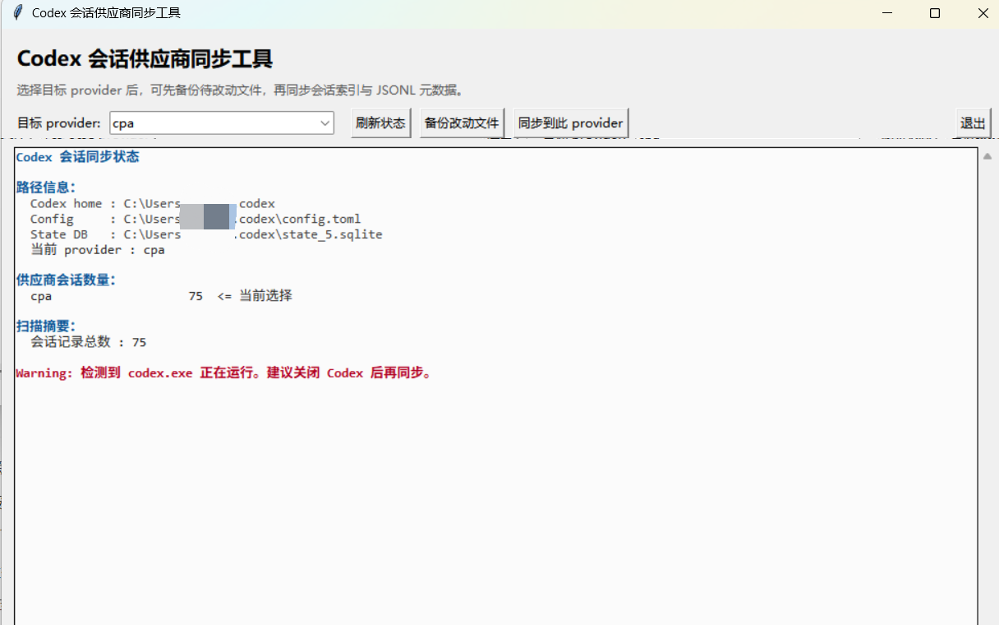

## Codex 会话供应商同步工具

用于解决 Codex CLI 切换 `model_provider` 后，`codex resume` 看不到其他模型供应商历史会话的问题。它会把本地 Codex 会话索引和会话文件里的供应商元数据同步到当前或指定的 `model_provider`。

## 适用场景

- 在 `~/.codex/config.toml` 中切换了 `model_provider`。
- 你希望不同模型供应商共享 `codex resume` 会话列表。
-  `codex resume --all` 只能关闭目录级过滤，能做到显示同一供应商下不同 `cwd` 的会话，但不能解决不同 `model_provider` 之间互相不可见的问题。

## 会改动什么

Codex 本地状态主要在：

```text
C:\Users\<你>\.codex\state_5.sqlite
```

工具会改动`threads`表中的`model_provider`字段：

```sql
UPDATE threads
SET model_provider = '<目标provider>'
WHERE model_provider <> '<目标provider>';
```

涉及表和字段：

| 文件 | 表/位置 | 字段 | 作用 |
| --- | --- | --- | --- |
| `state_5.sqlite` | `threads` | `model_provider` | `codex resume` 按供应商筛选会话的关键字段 |
| `state_5.sqlite` | `threads` | `rollout_path` | 指向对应的 `rollout-*.jsonl` 会话文件 |
| `rollout-*.jsonl` | 第一行 `session_meta.payload` | `model_provider` | 会话文件自身记录的供应商元数据 |

- 总结改动：数据库文件和会话文件

## 备份机制

点击“备份改动文件”或执行同步前，工具会生成 zip 压缩包：

```text
~\.codex\provider-sync-backups\provider-sync-backup-<时间>-to-<provider>.zip
```

压缩包内容：

- `state_5.sqlite` 的一致性快照，使用 SQLite backup API 生成。
- 即将被修改的 `rollout-*.jsonl` 会话文件。
- `backup-manifest.json`，记录目标 provider、待修改 thread、缺失文件、压缩包内路径等信息。

## 界面说明



- `目标 provider`：下拉列表，来自 `config.toml` 的 `model_provider`、`[model_providers]` 键名，以及 profile 中声明的 `model_provider`。
- `刷新状态`：重新读取数据库统计并更新界面。
- `备份改动文件`：只打包待改动文件，不修改数据库或会话文件。
- `同步到此 provider`：先自动生成 zip 备份，再改 `threads.model_provider` 和 JSONL 元数据。

## 风险和影响

- 原始供应商归属会被重新标记，但修改前会自动生成 zip 备份。
- 默认 `codex resume` 仍可能按当前目录过滤，跨目录查看仍需要 `codex resume --all`。
- 不建议在 Codex 正在运行时同步，避免 SQLite 锁或状态竞争。
- Codex 升级后如果数据库结构变化，工具会先检查必要字段，缺字段会拒绝写入。

## 重新打包

如修改源码后需要重新生成 exe，双击：

```text
build_exe.bat
```

## 推荐流程

1. 关闭 Codex。
2. 切换 `~/.codex/config.toml` 的 `model_provider`。
3. 打开 `codex_session_bridge.exe`。
4. 从下拉列表选择目标 provider。
5. 点击“刷新状态”确认当前会话分布。
6. 点击“同步到此 provider”执行同步。

